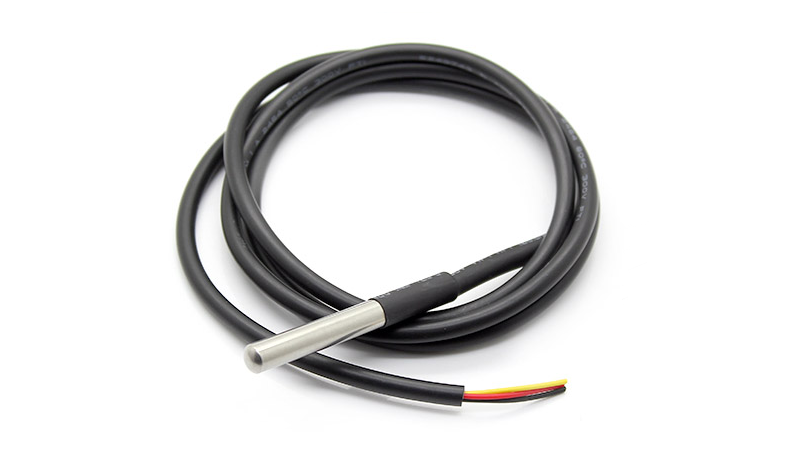

# 1-Wire Temperatur-Sensor




Zur Temperaturmessung kannst Du 1-Wire Temperatur-Sensoren vom Typ **DS18B20** an OpenPlotter anschließen. Es gibt die Sensoren auch wie abgebildet in einer wasserdichten Ausführung (in einer Metallhülse), die Messung hoher Temperaturen bis 125°C ist mit sehr guter Genauigkeit möglich. An einer Bus-Leitung kann mehrere DS18B20 parallel anschließen, sie haben zur Unterscheidung einzigartige fest eingebrannte Adressen. Einsetzbar sind die Sensoren z.B. für Motorkühlung, Öltemperatur, Motorraum, Kühlschrank, Seewasse etc.

## Verdrahtung

Die Drahtenden werden gemäß der Abbildung unten angeschlossen.


Die Sensoren werden an die Pins **GPIO4** (auch bekannt als GCLK), **GND** und **3.3V** angeschlossen. Manche Sensoren haben einen vierten Draht, dieser muss nicht angeschlossen werden. Ein Pull-Up Widerstand muss wie in der Abbildung (R1 = 4,7kOhm) angeschlossen werden. Es wird nur ein Widerstand benötigt, auch bei Anschluss mehrerer DS18B20.


Wenn der GPIO-Pin GPIO04 geändert werden soll, ändere die Datei config.txt durch folgenden Aufruf auf Kommandoebene:

```sudo nano /boot/config.txt```

Am Ende der Datei steht diese Zeile:

*dtoverlay=w1-gpio*

Die Zeile wird so ersetzt:

*dtoverlay=w1-gpio,gpiopin=x*

bei X handelt es sich um den neu ausgewählten GPIO-Pin. Speichern mit CTRL-O, benden mit CTRL-X und neu starten (sudo reboot)
