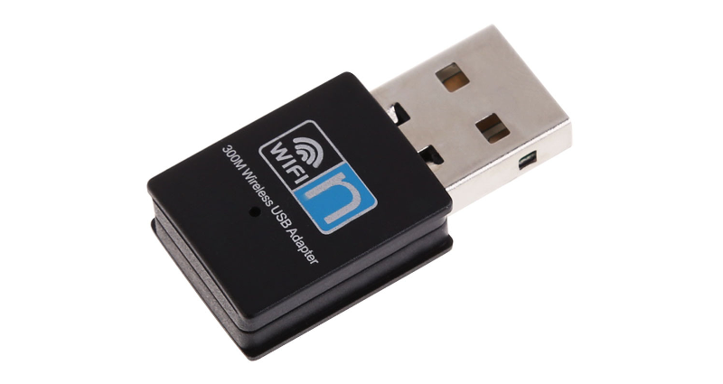

# USB WiFi dongle

---

**This chapter needs to be written/updated/translated**

http://forum.openmarine.net/forumdisplay.php?fid=16

---

You can set OpenPlotter either as access point to allow devices to connect to it or as client to connect to any access point. You can not do this at the same time with just one WiFI device so you will need an extra USB WiFi dongle for Raspberry 3 and two USB WiFi dongles for Raspberry 2 to do this.

Being connected to an access point as client to get Internet connection and at the same time running OpenPlotter as access point, you will be able to share Internet connection with all devices connected to OpenPlotter.

A good WiFi adapter will probably need more power than the Raspberry Pi USB port can provide, especially if there is a large distance from the WiFi adapter to the WiFi Access Point, or it is transferring large amounts of data. Therefore, you may need to plug the WiFi adapter into a powered USB hub.

Not all WiFi dongles can function as access point, only devices with the correct chipset will work. We recommend **RTL8192CU/CUS** chipset.

## Settings

See [WiFI AP](/wifi-ap.md) chapter to configure OpenPlotter as client or access point.