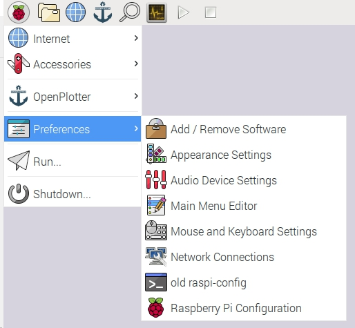

# Getting started

First of all you have to put together all the [required parts](what_do_you_need.md). If you have trouble with some aspect, try to find help on the [Raspberry Pi official page](https://www.raspberrypi.org/help/).

Second you have to run the software on your ARM computer and here you have two options, either buy our plug and play SD card or download and install the software on an SD card.

---

**Buy an 8 GB SD card with OpenPlotter RPI ready to run.**

[http:\/\/www.sailoog.com\/shop-category\/openplotter](http://www.sailoog.com/shop-category/openplotter)

---

## Installing OpenPlotter RPI on an SD card

Any micro-SD-compatible card will worl on your Raspberry, although there are some guidelines that should be followed:

A minimum of 8GB is required but 16GB is recommended.

The card class determines the sustained write speed for the card; a class 4 card will be able to write at 4MB/s, whereas a class 10 should be able to attain 10 MB/s. However it should be noted that this does not mean a class 10 card will outperform a class 4 card for general usage, because often this write speed is achieved at the cost of read speed and increased seek times.

Download the last noobs version of **OpenPlotter RPI** from

[http:\/\/sailoog.com\/blog-categories\/openplotter-rpi](http://sailoog.com/blog-categories/openplotter-rpi)

It is a compressed file ca. 1GB so it will take a while.

Once the download is completed we have to unzip it and copy all files from the noobs folder onto a micro SD FAT32 formated card minimum 8 GB.

If you bought our SD card you just from here.

Now we will insert the created or bought SD card with OpenPlotter RPI into our Raspberry Pi.

First boot

If you want to build a headless system see the next chapter [Headless](headless.md) before reading further.

Connect power to the RPI.

Now we wait for the noobs menu.

In the noobs menu we select openplotter and click install. It takes several minutes to format and install the system.

When noobs has finished openplotter starts.

[AutoSetup](/auto-setup-usb-ports.md) pops up (We can skip or close it. It will appear on every boot until we uncheck setup autostart on every boot).

The nativ monitor resolution for 800x480 monitors will be auto detected. The right settings for it will work on the next boot! If we have such a monitor. We do a restart.

## Personal settings

Go to _Menu_ &gt; _Preferences_ and select _Raspberry Pi Configuration_.

A window will open and it's a good idea to change the Password to make OpenPlotter more secure. Click on _Change Password_ \(default password: raspberry\).

### Setting language and country

You need to set your system localisation, click on the _Localisation_ tab and then on _Set Locale_, _Set Timezone, _ _Set Keyboard, Set WiFi Country_ buttons.

To configure openplotter we start with setting up the usb adapter [Auto Setup USB ports](auto-setup-usb-ports.md).

### Security

Because of security reasons **ssh is disabled by default** and can be activated under Interfaces.

Then we can use:

on windows system PuTTY and WinSCP

on linux system putty and nautilus

to exchange files and get a remote terminal.

**Keep it disabled if you don't need it!**