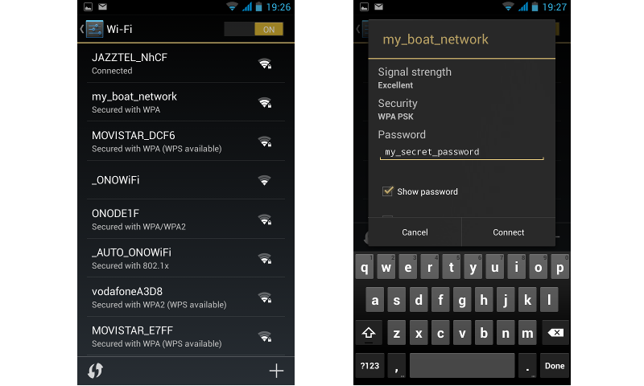

# Headless

In order to save money and power, you can use the system without monitor. Connecting your desktop computer, laptop, tablet or smartphone to OpenPlotter by remote desktop, you will be able to access to the interface. To do this, we have to convert openplotter into a WiFi hotspot to connect our devices.

Once we have created the SD card with OpenPlotter RPI, we have to insert it into any computer with any OS (Linux, MAC, Windows). The mounted device should be called *boot* and there should be a file called *config.txt*. Open this file in a text editor like notepad on windows, but not anything like MS Word which can save it as something which is not just plain text.

The top lines should look like this:

```
[OPENPLOTTER]

#HEADLESS

#uncomment to force screen resolution (only VNC remote desktop)
#framebuffer_width=800
#framebuffer_height=600

#uncomment to set WiFi access point
#device=wlan0
#ssid=OpenPlotter
#pass=12345678

[RASPBIAN]
...
```
If you are going to connect to OpenPlotter by VNC remote desktop, you have to remove the # character from words  ***framebuffer_width*** and ***framebuffer_height*** and set the screen size (800x600 by default). 

If you are going to connect to OpenPlotter by RDP remote desktop, you do not have to remove the # characters from words *framebuffer_width* and *framebuffer_height*, you will set the screen size from RDP software. See more information in [Remote desktop](remote_desktop.md) chapter.

To create the WiFi hotspot you have to remove the # character from words ***device***, ***ssid*** and ***pass***. 

If only one WiFi dongle is connected, the *device* value should always be *wlan0* but if more than one is connected, the *device* value could be *wlan0*, *wlan1* ...

*ssid* will be the name of your WiFi network. Use any character but a maximun of 32.

*pass* will be the password of your WiFi network. Use any character but a minimum of 8.

After changes, the top lines should look like this:

```
[OPENPLOTTER]

#HEADLESS

#uncomment to force screen resolution (only VNC remote desktop)
framebuffer_width=800
framebuffer_height=480

#uncomment to set WiFi access point
device=wlan0
ssid=my_boat_network
pass=my_secret_password

[RASPBIAN]
...
```

Save and eject the SD card, then insert it into the Raspberry Pi. Make sure the WiFi dongle is also inserted and power up the Pi.

After it has finished booting up, there should be a new WiFi network called *my_boat_network* available. Log onto this network using the password *my_secret_password*.



Finally, open your favourite VNC remote desktop client on your laptop, tablet or smartphone and make a new connection with the address/port combination: **10.10.10.1:5900**, or just the address **10.10.10.1** if you are using a RDP remote desktop client.

Connect and enjoy!


See more information about tested remote desktop software in [Remote desktop](remote_desktop.md) chapter.