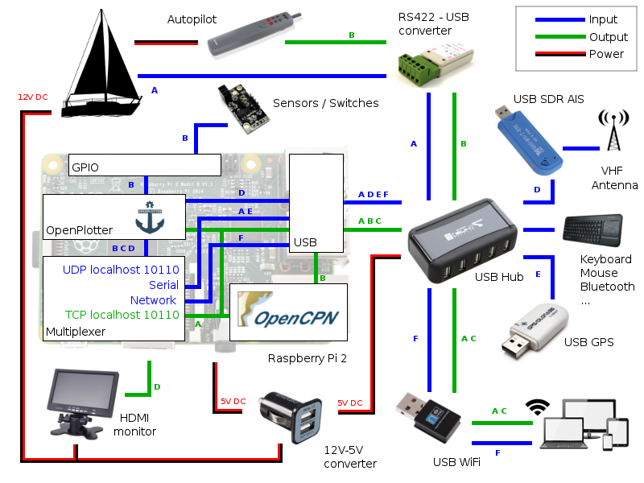

# How does it work?

Basically, OpenPlotter collects NMEA data from different sources:
* Sensors trough GPIO port.
* Serial devices trough USB.
* Any computer or portable device connected to the same network.

Some of them directly send NMEA data but others need to be processed by OpenPlotter before create NMEA data.

All these sources are gathered in an unique NMEA stream which is sent to:

* OpenCPN to show your boat over the chart.
* Other external devices connected by serial or WiFi.
* OpenPlotter again to calculate new NMEA sentences.

##Inputs
* **A**. NMEA data from your boat equipment (GPS, wind, depth...).
* **B**. Raw data from the IMU sensor is processed, converted to Compass NMEA data  and sent to UDP localhost 10110 input by OpenPlotter. If barometer is present, weather data will be logged.
* **C**. If Openplotter has the required data, it will be able to calculate NMEA for Magnetic Variation, True Heading and True Wind. The new sentences will be sent to UDP localhost 10110 input.
* **D**. AIS signal from the DVB-T dongle is received and decoded by OpenPlotter. Generated NMEA data is sent to UDP localhost 10110 input.
* **E**. If you have an USB GPS dongle, you will have to create a serial input.
* **F**. You can receive NMEA data from any device connected to OpenPlotter by WiFi. You have to create a TCP/UDP input.

##Outputs
* **A**. Multiplexed NMEA stream. All inputs gathered in TCP localhost 10110 output. It is sent to OpenCPN, other external devices and OpenPlotter for calculations.
* **B**. Orders to autopilot. It can be sent to a serial device directly from OpenCPN.
* **C**. Remote desktop.
* **D**. Video and audio output by HDMI port. Alternatively, you can get analog video and audio using the composite port.
