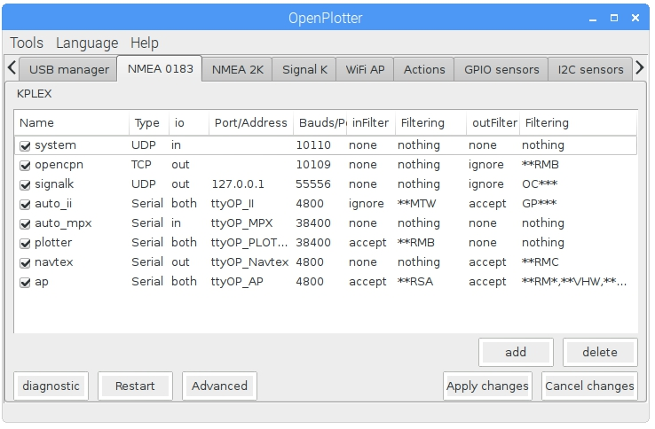
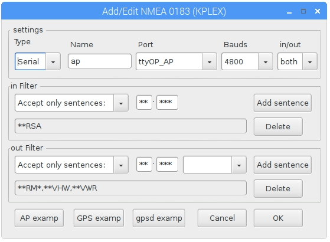

# NMEA 0183 Multiplexer

It is important that you understand that OpenPlotter must drive all the NMEA data traffic to work properly, so you do not need to configure OpenCPN to get GPS signal, we will set this in OpenPlotter NMEA 0183 tab.

## System defaults

There are three lines which couldn't be changed.

* system: Used by SDR-AIS, by Calculate and by NMEA 0183 generator
* opencpn: this is the datastream to opencpn
* signalk: this is the nmea 0183 stream to SignalK

Names with auto\_xxx are made by Auto Setup USB ports to set the correct baudrate \(the filters aren't set !!!\).

# Adding or changing a connection

* press add
* double click line to be edit

  
Kplex can work with Serial, TCP or UDP connection \(Type\).

Name: lower case letters should be meaningful

Port:

* Serial: The name of the port ttyxxxxx
* TCP / UDP: port number

Bauds: Baudrate for serial port

in / out:

* Serial: both, in, out
* TCP / UDP: in, out

in Filter: Data coming from the device

* none
* Accept only sentences
* Ignore sentences

  * \*\*: device id
  * \*\*\*:type

  Use Add sentence to add a selection.

out Filter: Data send to the device. Same as above but filter can be connected to a given name

The three example buttons load default filter.

# Diagnostics

On NMEA 0183 tab is the button diagnostic.

Select a line and click the button.

One or two windows pop up \(two if setting is "both"\).

They show the transfered sentences

On the lower left side you can see the calculated transfer speed in baud.

**! If the output speed is higher than the baudrate of the device some data will be cut. Select filters to send only needed data!**

# Advanced

There are many settings which could be done in OpenPlotter directly. But Kplex has advanced options which aren't used often. These settings or filter can be done between the lines

_\#\#\#end of OpenPlotter GUI settings_

_\#\#\#Manual settings_

