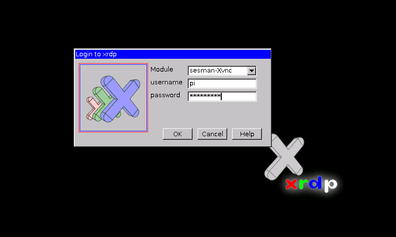

# Remote desktop

To connect to the raspberry pi openplotter can setup an AP \(access point\) or and can be connected by an ethernet cable.

It can be easily connected by bonjour protocol with "openplotter.local" as address or use the IP address. 

The IP address of openplotter as WiFi access point is **10.10.10.1 **as default.

In \/home\/pi\/.config\/openplotter\/openplotter.conf you can change the address manually.

If you connect the raspberry pi to a router by ethernet cable \(and bridge mode isn't checked\) the raspberry pi will get the IP address from the routers dhcp server. So connect to the router and look what IP address it sets for openplotter.

You have to install a remote desktop client on your remote device. There are two types, VNC and RDP, and some applications can use both of them.

VNC replicates the current desktop in OpenPlotter.

RDP can replicate the current desktop or create a new one with different resolution if you want. RDP is faster than VNC.

## VNC

Be sure the checkbox _VNC remote desktop_ is enabled in the _Startup_ tab.

To connect by VNC you have to provide the IP of OpenPlotter and the port 5900.

## RDP

To connect by RDP you have to provide just the IP. Then you will be prompted for the password of user _pi_. If you have not changed it, it should be _raspberry_. When using Module sesman-Xvnc you get a new desktop. If you want to replicate the current desktop use Module console.

### Tested remote desktop clients

**VNC**

Linux: Vinagre.

Windows: RealVNC Viewer, TightVNC.

Android: bVNC, RealVNC Viewer, VNC per Android.

IOS: RealVNC.

**RDP**

Linux: Vinagre.

Windows: Windows 10 Remote Desktop Client, Windows CE 5.0 Remote Desktop Client.

Android: load an old apk \(microsoft-remote-desktop-8-0-5-24406-en-android.apk\)

