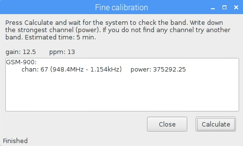
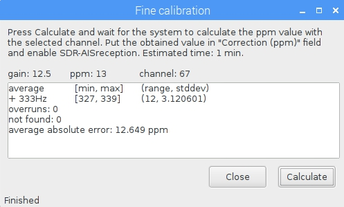
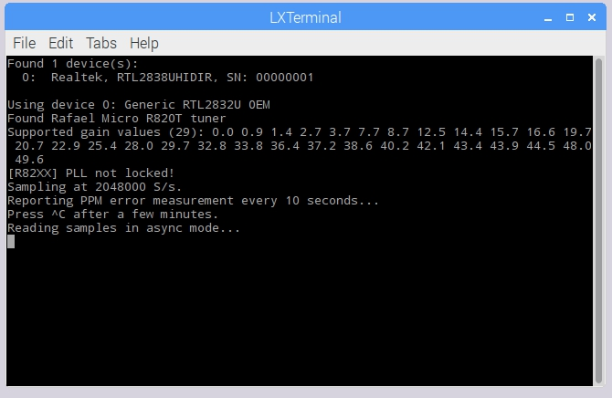
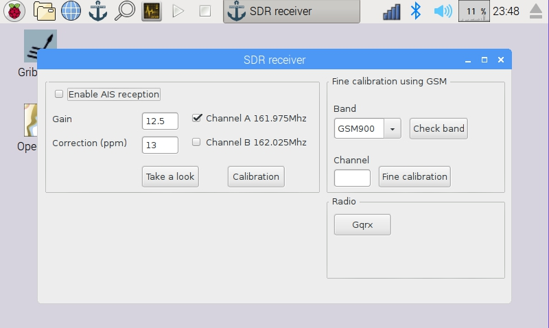

#SDR receiver 

DVB-T dongle \(AIS\)

---

DVB-T dongles based on the Realtek RTL2832U chip and the new R820T2 tuner can work as a SDR AIS receiver.

A DVB-T dongle will need more power than the Raspberry Pi USB port can provide. You need to plug the dongle into a powered USB hub. Connecting and disconnecting can draw too much power and cause malfunction, try to do it when the system is off.

OpenPlotter is ready to get SDR AIS signal out of the box, you just have to calibrate to find **gain** and correction \(**ppm**\) values.

### Fine calibration

It takes a few minutes after starting **Check band **and push **Calculate**.

This is an example result.

If there are more "chan:" take the line with the highest power and put the "chan:" into **Channel** field and push **Fine calibration **and then **Calculate.**

For this example the field **Correction \(ppm\) **should be set to 13.

Now we look for the gain setting. Please push buttom **Calibration**.

The line **Supported gain values** is interesting for us. The max gain here is 49.6. Input this into the **Gain** field.

You can buy our DVB-T dongle and we can calibrate it for you and include a note with the gain and ppm values:

[http://shop.sailoog.com/en/4-usb-sdr-ais-receiver.html](http://shop.sailoog.com/en/4-usb-sdr-ais-receiver.html)

or you can follow this detailed guide:

[http://sailoog.dozuki.com/Guide/Connecting+and+calibrating+SDR-AIS+dongles/3](http://sailoog.dozuki.com/Guide/Connecting+and+calibrating+SDR-AIS+dongles/3)

## AIS - receiving

Once you have found your **gain** and **ppm** value, select _**Enable AIS reception**_.

**You do not need to enable the rtlsdr plugin in OpenCPN**. If you want to use that plugin you must disable SDR AIS reception in OpenPlotter.

## Antenna

Although you can get to receive some boat with the supplied mini antenna, it is not enough for optimal reception of AIS frequencies. Any VHF antenna with the appropriate connector adapter will work fine. The antenna connector type of the dongle is female MCX.

Some home-made antennas:

[http://sdrformariners.blogspot.com.es/p/blog-page.html](http://sdrformariners.blogspot.com.es/p/blog-page.html)

[http://nmearouter.com/docs/ais/aerial.html](http://nmearouter.com/docs/ais/aerial.html)

[https://www.youtube.com/watch?v=SdEglNHyHB4](https://www.youtube.com/watch?v=SdEglNHyHB4)

## gqrx

gqrx is an application which also use the rtl2832u to receive something.

**This gqrx-2.6-rpi3-1 version only supports RPI 3!**

You can listen to:

* Radio in different waves
* vhf radio
* data

Be sure that the rtl2832u isn't used by openplotter or any other application.
**It does consume much processor power. Other processes could be negative affected.**

Settings to begin with:

* configure I/O devices Input rate 240000

* Receiver Option Mode WFM \(mono\) FM radio

* Receiver Option Narrow FM FM marine radio

* FFT Settings Rate 5 fps 0 fps for low processor load

* Audio Gain 24.8 dB

# wireless temperature sensors

_advanced alpha features for experts_

433 MHz temperature and humidity sensors known from wireless home weatherstations can be connected via rtl2832u to openplotter.

To translate this sensors to signalk use the python script tools\/rtl\_433SK.py.

It can be integrated as tool. Add "\[\['433 Temp', 'get wireless temp', 'rtl\_433SK.py', '0'\]\]" this behind "py=" in openplotter.conf section \[TOOLS\].
