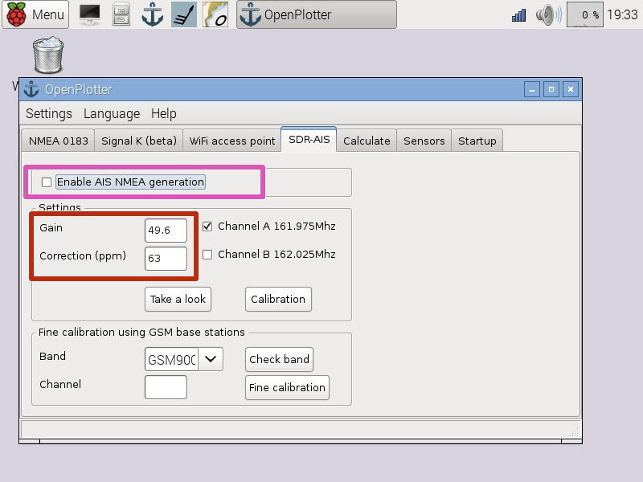
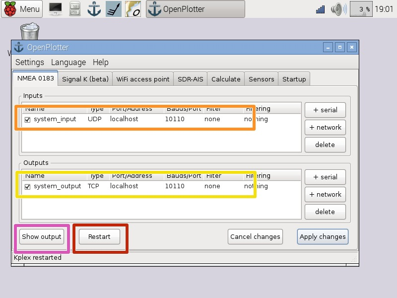
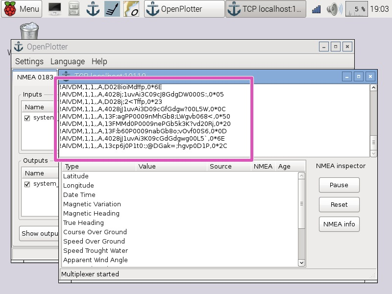
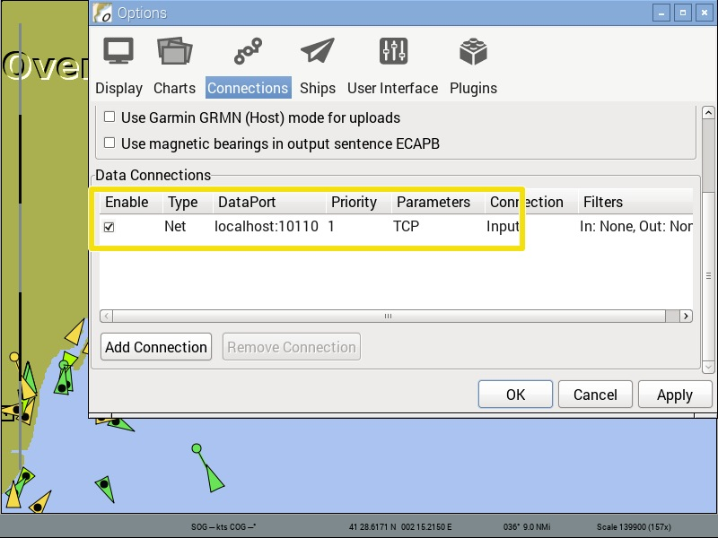

# DVB-T dongle (AIS)

DVB-T dongles based on the Realtek RTL2832U chip and the new R820T2 tuner can work as a SDR AIS receiver. OpenPlotter is ready to get SDR AIS signal out of the box, you just have to calibrate.

A DVB-T dongle will need more power than the Raspberry Pi USB port can provide. You need to plug the dongle into a powered USB hub.

You can buy our DVB-T dongle and we can calibrate it for you and include a note with the gain and correction value (ppm):

http://www.sailoog.com/shop-category/openplotter

or you can follow this detailed guide:

http://sailoog.dozuki.com/Guide/Connecting+and+calibrating+SDR-AIS+dongles/3

## Antenna

Although you can get to receive some boat with the supplied mini antenna, it is not enough for optimal reception of AIS frequencies. Any VHF antenna with the appropriate connector adapter will work fine. The antenna connector type of the dongle is female MCX.

Some home-made antennas:

http://sdrformariners.blogspot.com.es/p/blog-page.html

http://nmearouter.com/docs/ais/aerial.html

https://www.youtube.com/watch?v=SdEglNHyHB4

## Receiving

Once you have found your **gain** and **correction** value (in red), select ***Enable AIS NMEA generation*** (in pink).

If you have AIS traffic around, AIS NMEA data will be decoded and sent to **UDP localhost 10110 input** (in orange).

If you want to have access to AIS data you will have to connect your software (OpenCPN) to **TCP localhost 10110 output** (in yellow).

Press **Restart** (in red) to be sure the multiplexer is working.

Press **Show output** (in pink) to see AIS data in the NMEA Inspector.

Be sure OpenCPN is listening to **TCP localhost 10110**(in yellow).