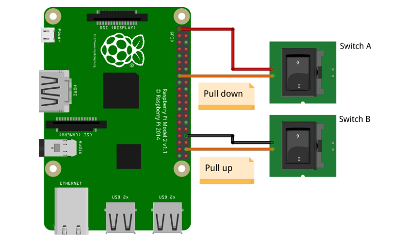

# Wiring digital sensors

---

**This chapter needs to be written/updated/translated**

http://forum.openmarine.net/forumdisplay.php?fid=16

---

Digital sensors are driven through the **GPIO** (General Purpose Input/Output) pins. These pins are copper connected to the CPU chip. A short circuit with 0 V or +3.3 V is not final, but any direct contact with the + 5 V \(or higher\) can KILL the Raspberry Pi.

Pins names are according to the diagram below.

For a normal digital sensor (open by default), you have to configure it as "Pull down" and to connect it between selected GPIO pin and +3.3v pin (DANGER, NEVER TO +5v). 

For a special digital sensor (closed by default), you have to configure it as "Pull up" and connect it between selected GPIO pin and GND pin.

It is not a problem if you make a mistake connecting to GND or +3.3v but be careful and avoid the +5v pin.

## Available pins for digital sensors

## Powered digital sensors

