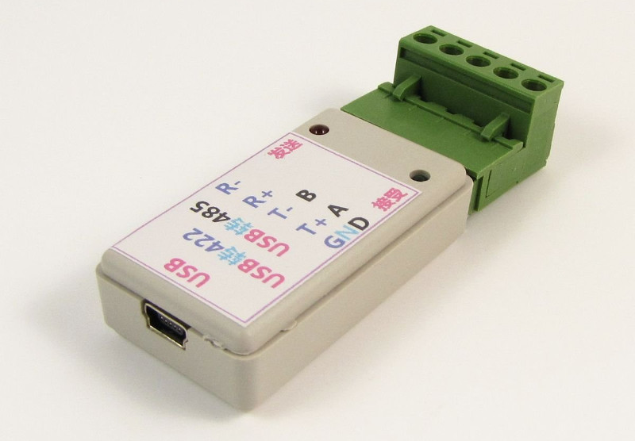
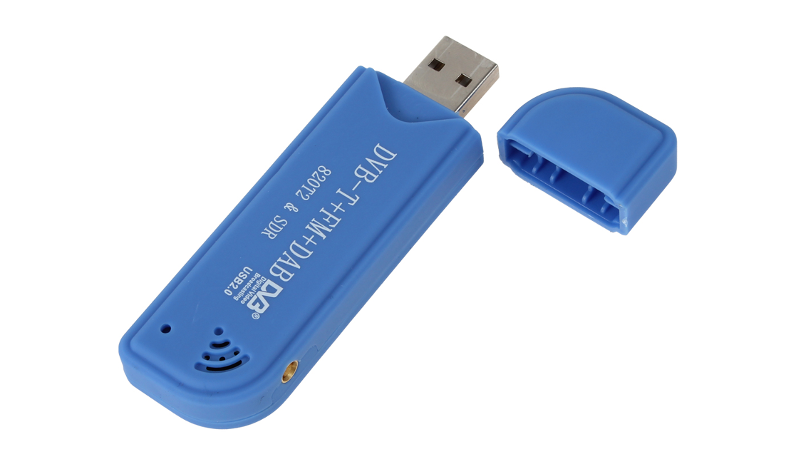
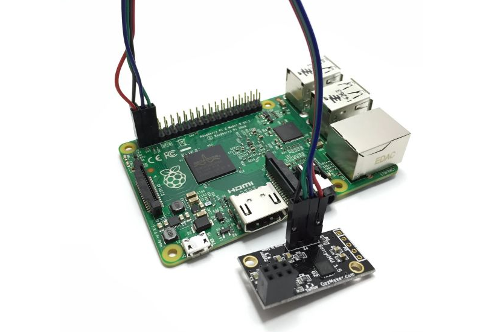

###OPTIONS 

---

**HUB USB AUTO-ALIMENTÉ**

---

Si vous connectez des périphériques exigeant plus de puissance que le Raspberry Pi ne peut en fournir, vous aurez besoin d'un hub USB possédant sa propre alimentation.
Vous pouvez par exemple choisir un hub fonctionnant sur 5V afin de l'alimenter avec le même adaptateur que le Raspberry Pi.

Achetez un hub USB testé pour OpenPlotter:
http://www.sailoog.com/shop-category/openplotter

---

**DONGLE WIFI USB**

---

Vous aurez besoin d'une clé WIFI si vous voulez utiliser OpenPlotter comme multiplexeur WIFI, ou pour connecter votre Pi à internet.

Les ports USB du Raspberry Pi pourront accueillir votre clef WIFI, mais dans le cas d'un grand volume de données à faire transiter, ou d'un fort éloignement de votre point d'accès, vous pourrez préférer lui assurer toute la puissance nécessaire en le branchant sur un hub auto-alimenté.

Pour partager les données NMEA du bord en WIFI (tablettes, smartphones, écran déporté, etc...), OpenPlotter vous permet de créer un point d'accès WIFI. Toutes les clés WIFI n'offrant pas cette fonctionnalité, nous vous recommandons les clés à base de chipset RTL8192CU/CUS. Les chipsets RT5370 et RTL8188CU/CUS sont également compatibles.

Achetez un dongle WIFI USB testé pour OpenPlotter:
http://www.sailoog.com/shop-category/openplotter

---

**DONGLE GPS USB**

---

Si vous ne disposez d'aucun GPS à bord ou que vous voulez une source de positionnement supplémentaire, c'est la solution la plus simple et la moins chère. Un dongle GPS de ce type vous fournira une géolocalisation précise, ainsi que les données de vitesse fond (SOG) et route fond (COG).

Commandez une clé GPS/GLONASS testée pour OpenPlotter:
http://www.sailoog.com/shop-category/openplotter

---

**CONVERTISSEUR NMEA-0183 / USB**

---

Si vos équipements du bord mettent à votre disposition des données NMEA-0183, ce convertisseur vous permet de transférer ces données à OpenPlotter, qui les redistribuera à OpenCpn et à vos mobiles grâce au multiplexeur. Vous pouvez aussi utiliser sa sortie pour envoyer les données, par exemple à un pilote automatique.

Trouvez un convertisseur NMEA-0183 / USB testé pour OpenPlotter:
http://www.sailoog.com/shop-category/openplotter

---

**DONGLE DVB-T USB**

---

Les dongles DVT-B basés sur le chipset Realtek RTL2832U peuvent être utilisés comme récepteurs AIS à bas coût. Ces clés auront besoin de beaucoup de puissance, il est donc recommandé de les brancher en passant par un hub auto-alimenté.

Trouvez dongle DVB-T testé pour OpenPlotter:
http://www.sailoog.com/shop-category/openplotter

---

**ANTENNE**

---

Toute antenne VHF classique est utilisable. Si vous voulez en construire une vous-même, ces sites pourront vous y aider:

http://sdrformariners.blogspot.com.es/p/blog-page.html

http://nmearouter.com/docs/ais/aerial.html

https://www.youtube.com/watch?v=SdEglNHyHB4

---

**IMU**

---

Une IMU (Inertial Measurement Unit) mesure et transmet les données de vélocité, d'orientation et d'accélération en combinant les données d'un accéléromètre, d'un gyroscope et d'un compas électronique sensible aux champs magnétiques. Certaines IMU comprennent également un capteur de pression atmosphérique (baromètre) et un capteur de température.

La connexion d'une IMU à OpenPlotter vous fournira le cap magnétique qui seront utiles au calcul du vent vrai et du cap vrai. De plus, si un baromètre et un thermomètre sont détectés, ces données seront affichées sous forme graphique et conservées dans un fichier journal pour analyse météo.

**Imu compatibles:**

* InvenSense MPU-9150 single chip IMU.

* InvenSense MPU-6050 plus HMC5883 magnetometer on MPU-6050's (géré par le driver MPU-9150).

* InvenSense MPU-6050 gyros + accéléromètres. Identique à la MPU-9150 sans magnétomètre.
    
* InvenSense MPU-9250 single chip IMU (I2C and SPI).
    
* STM LSM9DS0 single chip IMU.
    
* STM LSM9DS1 single chip IMU.
    
* L3GD20H + LSM303D (LPS25H en option) comme utilisé sur l'AltIMU-10 v4 de Pololu .
    
* L3GD20 + LSM303DLHC comme utilisé sur l'IMU 9-dof d'Adafruit (ancienne version avec un gyro GD20).

* L3GD20H + LSM303DLHC (avec option BMP180) comme utilisé sur la nouvelle 10-dof IMU d'Adafruit.

* Bosch BMX055 (le gestion du magnétomètre est au stade expérimental).

* Bosch BNO055 IMU. Note: ne fonctionnera pas de façon fiable sur les Raspberry Pi en raison de soucis de timing.

---

**CAPTEURS DE PRESSION ATMOSPHÉRIQUE / TEMPÉRATURE**

---

Les capteurs de pression et de température peuvent être trouvés sur une même petite carte. Ils vous fourniront des graphiques vous permettant d'étudier la météo.

Les capteurs compatibles sont:

* BMP180

* LPS25H

* MS5611

* MS5637
