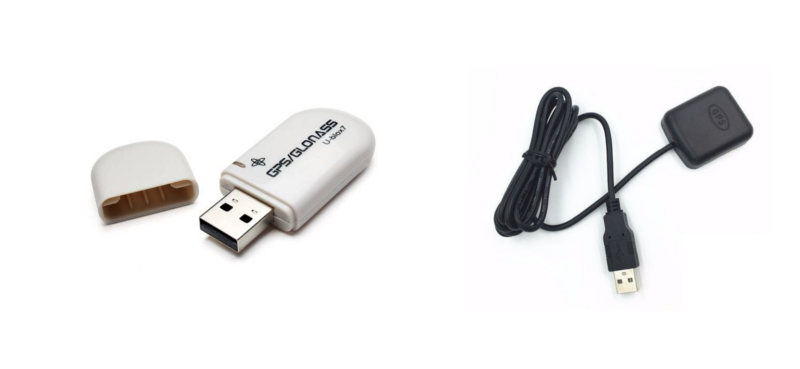

# USB GPS Stick

Wanneer je helemaal geen GPS aan boord hebt of als je een extra locatie apparaat wilt hebben is dit de goedkoopste en meest effective manier.

Het aansluiten van een GPS Stick aan OpenPlotter geeft je een accurate positie, datum/tijd en snelheid/koers over grond.

## Settings

Zie [NMEA 0183](/nmea-0183.md) hoofdstuk over de configuratie van USB GPS sticks.
